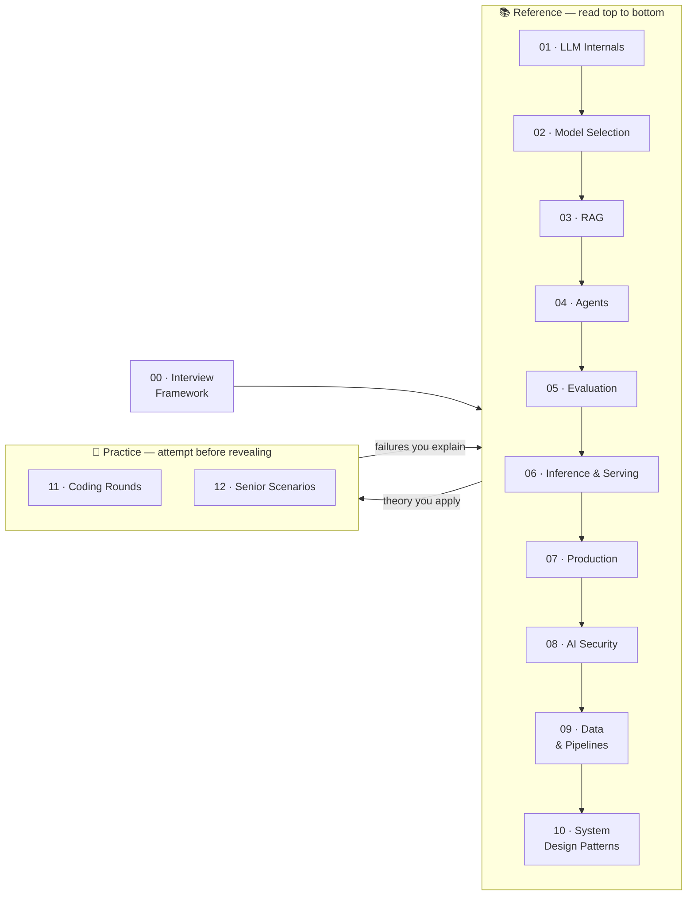

<div align="center">



<br>

[](https://github.com/Laleeth/The-AI-Engineer-s-Playbook/actions/workflows/verify.yml)
[](scripts/verify.py)
[](scripts/verify.py)
[](ROADMAP.md)
[](LICENSE)

**Everything here is scenario-driven. Every code block runs. Every number is re-computed in CI.**

[Start reading](#where-to-start) · [See a sample](#what-it-actually-looks-like) · [How it's verified](#how-this-is-verified) · [Roadmap](ROADMAP.md)

</div>

---

## What this is

Preparation material for engineers interviewing for roles where the job is to **reason
about, build, debug, scale, and operate real AI systems** — Senior/Staff AI Engineer, ML
Engineer, Applied AI Engineer, LLM Engineer, AI Platform Engineer, AI Architect.

It is also a straight reference for people doing that work now.

<table>
<tr>
<td width="50%" valign="top">

### ✅ What you'll find

- Scenarios with real numbers and competing constraints
- Problems that **evolve**: traffic ×15, costs ×3, security changes the rules
- Trade-offs with the conditions under which each option wins
- Failure modes, and what breaks in the fix
- Reference implementations that were **executed**, not just written
- Interviewer notes: what's actually being assessed

</td>
<td width="50%" valign="top">

### ❌ What you won't

- "What is RAG?" and other definitions
- Scraped question lists
- Buzzword bingo
- Framework-version trivia that ages in a month
- Anything with one memorized answer
- Architectures nobody would ship

</td>
</tr>
</table>

> **The test every question had to pass:** *could an experienced AI engineer learn
> something from this?* If not, it was rewritten or cut.

---

## Where to start

The repo has two kinds of content, and they're written differently on purpose.



| I want to… | Go to |
|---|---|
| Prepare for interviews | [00 — Interview Framework](00-interview-framework/) — read this first |
| Understand how something works | [01](01-llm-internals/) · [02](02-model-selection/) · [03](03-rag/) · [04](04-agents/) · [05](05-evaluation/) · [06](06-inference-serving/) · [07](07-production/) · [08](08-ai-security/) · [09](09-data-pipelines/) · [10](10-system-design-patterns/) |
| Practice for an interview | [11 — Coding Rounds](11-coding-rounds/) · [12 — Senior Scenarios](12-senior-scenarios/) |
| Debug something right now | [rag-debugging](03-rag/rag-debugging.md) · [agent-failure-modes](04-agents/agent-failure-modes.md) · [incident-response](07-production/incident-response.md) |
| Cut my inference bill | [prefill-vs-decode](01-llm-internals/prefill-vs-decode.md) · [cost-quality-latency](02-model-selection/cost-quality-latency.md) · [reranking](03-rag/reranking.md) |
| Size an inference fleet | [capacity-planning](06-inference-serving/capacity-planning.md) · [kv-cache](01-llm-internals/kv-cache.md) · [scaling](12-senior-scenarios/scaling.md) |
| Serve a model myself | [continuous-batching](06-inference-serving/continuous-batching.md) · [gpu-economics](06-inference-serving/gpu-economics.md) · [autoscaling](06-inference-serving/autoscaling.md) |
| Get content into the index | [document-parsing](09-data-pipelines/document-parsing.md) · [ingestion-pipelines](09-data-pipelines/ingestion-pipelines.md) · [incremental-indexing](09-data-pipelines/incremental-indexing.md) |
| Know if my change helped | [regression-testing](05-evaluation/regression-testing.md) |
| Keep a live system healthy | [observability](07-production/observability.md) · [fallbacks](07-production/fallbacks.md) · [caching](07-production/caching.md) |
| Secure an AI system | [prompt-injection](08-ai-security/prompt-injection.md) · [authorization](08-ai-security/authorization.md) · [agent-security](08-ai-security/agent-security.md) |

---

## Sections

<table>
<tr><th align="left">Section</th><th align="left">Covers</th><th align="right">Files</th><th align="right">Words</th></tr>

<tr><td valign="top">

**[00 · Interview Framework](00-interview-framework/)**

</td><td valign="top">

what interviewers test · junior vs. mid vs. senior · answering system design · answering debugging

</td><td align="right" valign="top">4</td><td align="right" valign="top">8k</td></tr>

<tr><td valign="top">

**[01 · LLM Internals](01-llm-internals/)**

</td><td valign="top">

attention · tokenization · positional encoding · **KV cache** · prefill vs. decode · quantization · speculative decoding

</td><td align="right" valign="top">7</td><td align="right" valign="top">11k</td></tr>

<tr><td valign="top">

**[02 · Model Selection](02-model-selection/)**

</td><td valign="top">

API vs. self-hosted · routing · small vs. large · fine-tuning vs. RAG · cost/quality/latency

</td><td align="right" valign="top">5</td><td align="right" valign="top">9k</td></tr>

<tr><td valign="top">

**[03 · RAG](03-rag/)**

</td><td valign="top">

architecture · chunking · embeddings · hybrid search · reranking · query rewriting · contextual retrieval · multimodal · debugging

</td><td align="right" valign="top">9</td><td align="right" valign="top">17k</td></tr>

<tr><td valign="top">

**[04 · Agents](04-agents/)**

</td><td valign="top">

agent vs. workflow · tool calling · planning · memory · multi-agent · MCP · permissions · failure modes

</td><td align="right" valign="top">8</td><td align="right" valign="top">16k</td></tr>

<tr><td valign="top">

**[05 · Evaluation](05-evaluation/)**

</td><td valign="top">

frameworks · golden datasets · RAG eval · LLM-as-judge · agent eval · regression testing · online measurement

</td><td align="right" valign="top">7</td><td align="right" valign="top">14k</td></tr>

<tr><td valign="top">

**[06 · Inference & Serving](06-inference-serving/)**

</td><td valign="top">

serving stacks · **continuous batching** · capacity planning · autoscaling & cold starts · multi-GPU · load balancing · GPU economics

</td><td align="right" valign="top">7</td><td align="right" valign="top">12k</td></tr>

<tr><td valign="top">

**[07 · Production](07-production/)**

</td><td valign="top">

observability · tracing · retries · fallbacks · rate limits · caching · cost control · incident response

</td><td align="right" valign="top">8</td><td align="right" valign="top">16k</td></tr>

<tr><td valign="top">

**[08 · AI Security](08-ai-security/)**

</td><td valign="top">

prompt injection · data exfiltration · tool abuse · PII · **authorization** · agent security

</td><td align="right" valign="top">6</td><td align="right" valign="top">12k</td></tr>

<tr><td valign="top">

**[09 · Data & Pipelines](09-data-pipelines/)**

</td><td valign="top">

**document parsing** · ingestion pipelines · incremental indexing · data quality · corpus changes · backfills · schema & versioning

</td><td align="right" valign="top">7</td><td align="right" valign="top">11k</td></tr>

<tr><td valign="top">

**[10 · System Design Patterns](10-system-design-patterns/)**

</td><td valign="top">

request/response vs. async vs. streaming · human-in-the-loop · **batch vs. real-time** · multi-region · the platform pattern

</td><td align="right" valign="top">5</td><td align="right" valign="top">9k</td></tr>

<tr><td valign="top">

**[11 · Coding Rounds](11-coding-rounds/)**

</td><td valign="top">

LLM client · async inference · RAG from scratch · agent loop · retry & backoff · rate limiting · evaluation harness

</td><td align="right" valign="top">7</td><td align="right" valign="top">38k</td></tr>

<tr><td valign="top">

**[12 · Senior Scenarios](12-senior-scenarios/)**

</td><td valign="top">

architecture trade-offs · production incidents · cost vs. quality · build vs. buy · model selection · scaling · staff-level

</td><td align="right" valign="top">7</td><td align="right" valign="top">76k</td></tr>

<tr><td colspan="2" align="right"><b>Total</b></td><td align="right"><b>87</b></td><td align="right"><b>250k</b></td></tr>
</table>

**60 scenarios and coding problems**, many of which change their constraints round by
round.

> **Only 03 is about RAG.** Retrieval is one section of eleven. The rest covers inference
> internals, model economics, agents, evaluation, and production operations.

---

## What it actually looks like

Rather than describe the format, here's a real extract.

<details>
<summary><b>📄 A production incident — from <code>12-senior-scenarios/production-incidents.md</code></b></summary>

<br>

> **Situation.** At 14:20 UTC the latency alert fires. p95 has climbed from a stable
> 1.8s to 9.1s over 40 minutes. Error rate is normal. Traffic is slightly *below*
> average. Two deploys today: a frontend change at 09:00, and a "prompt copy tweak" at
> 13:45 by a PM using the prompt-management UI.
>
> **Round 1.** You ask for the latency decomposition:
>
> ```
>                       before      now      delta
> application overhead   120ms     144ms     +20%
> retrieval (embed+ANN)  210ms     215ms     ~flat
> reranking              180ms     186ms     ~flat
> LLM call              1,290ms   5,160ms    +300%
> ─────────────────────────────────────────────────
> error rate              0.4%      0.4%      flat
> input tokens (p50)     3,100     3,565     +15%
> output tokens (p50)      210       218     ~flat
> ```
>
> **What do you investigate next?**

The reasoning path is hidden behind a spoiler so you can try first. The trap: input
tokens rose 15%, which *cannot* explain a 300% latency rise — unless something crossed a
threshold. Retrieval being flat rules out half the system. Output tokens being flat rules
out decoding.

The answer is prefix-cache invalidation from editing the top of a prompt. The follow-ups
then change the situation: *it only recovers to 3.4s, now what?* And: *product refuses to
give up editing prompts without a deploy — design something safe.*

Every scenario carries **Trade-offs**, **What Could Go Wrong**, **Metrics**,
**Follow-ups**, **What Separates Senior From Staff**, and **Interviewer Notes**.

</details>

<details>
<summary><b>🧮 A finding that survived being checked — from <code>05-evaluation/</code></b></summary>

<br>

Prompt A scores **0.79**. Prompt B scores **0.83**. Same 200 cases. Ship B?

```
both correct     144
both wrong        20
B fixed it        22    ← only these
B broke it        14    ← and these carry information
                 ───
                 200
```

Only 36 cases disagree. McNemar's test gives **p ≈ 0.24**. Not significant. You'd need
roughly **880 cases** to detect a 4-point difference reliably.

Most teams ship on deltas like this and attribute the gain to their change.

*This example is re-computed by CI on every push — see
[`scripts/verify.py`](scripts/verify.py).*

</details>

<details>
<summary><b>⚙️ Reference code — from <code>11-coding-rounds/</code></b></summary>

<br>

Problems start from a production requirement, not a puzzle. The reference implementations
explain their decisions:

```python
async def call_with_retries(fn, max_attempts):
    for attempt in range(max_attempts):
        try:
            return await fn()

        except asyncio.CancelledError:
            # Never retried, never swallowed. The caller is gone; continuing
            # spends money for nobody. Swallowing CancelledError is also how
            # you make a task uncancellable — a very common bug.
            raise

        except TransientError:
            if attempt == max_attempts - 1:
                raise
            await asyncio.sleep(full_jitter(attempt))
```

And they were run. Testing the async worker pool found an error in my own explanation:
`break`ing out of an async generator does **not** run its cleanup promptly — Python defers
`aclose()` to garbage collection. Measured leaked tasks. The file now documents
`contextlib.aclosing` as the caller's contract.

</details>

---

## How this is verified

Most repositories in this space contain code nobody ran. This one runs it, in CI, on
every push.

```console
$ python scripts/verify.py

Verifying The AI Engineer's Playbook

PASS  475 python blocks parse
PASS  587 internal links resolve
PASS  numeric claims match the prose
PASS  the README describes the repo that exists

All checks passed.
```

Four checks. The last two are the unusual ones:

| Check | What it catches |
|---|---|
| **Python blocks parse** | Code that was never run |
| **Internal links resolve** | Rot, including anchors into other files |
| **Numeric claims re-computed** | Prose that drifted away from its arithmetic |
| **Self-description checked** | This page describing a repo that no longer exists |

The third re-derives every figure quoted in the docs — the API-vs-self-hosting break-even,
the storage tables, the 75% context reduction from reranking, the McNemar p-value, the
sample-size table, the quadratic agent-context growth. **Change a number in the prose and
CI fails until you change it in [`scripts/verify.py`](scripts/verify.py) too.**

The fourth points the same discipline at this page. The file counts, word counts, section
counts and scenario counts above are recomputed from the directories on every push, the
list of unwritten sections is derived from the gaps in the numbering, and the worked
example below is re-derived wherever it's quoted. It exists because that's where the
drift actually happened — see below.

<details>
<summary>Things this process actually caught</summary>

<br>

- **A bug in my own explanation.** I claimed `break` cleans up an async worker pool. It
  doesn't — cleanup is deferred to GC unless the caller uses `contextlib.aclosing`. Found
  by measuring leaked tasks, not by re-reading.
- **An arithmetic inconsistency.** The regression-testing worked example stated 0.79 and
  0.83, while its own breakdown summed to 0.81 and 0.85. Nobody would have caught that by
  reading.
- **The same inconsistency again, in a file the checks didn't cover.** Fixing the example
  fixed one copy of it; a second copy in a section README kept the wrong breakdown for
  months, under prose quoting the right scores. The example is now re-derived from its own
  numbers wherever it appears, in any file.
- **This page, describing a repo that no longer existed.** Two sections landed and the
  totals here stayed at 54 files and 190k words; the "still to come" list named two
  sections that were already written; and "10 of 12" never added up against a roadmap
  with thirteen numbered rows. Three claims about the repo, in the one document everyone
  reads first. That's what the fourth check is for.
- **An invisible SVG gradient.** A gradient with default `objectBoundingBox` units on a
  zero-height line renders as nothing — which is why the banner's pipeline wire was
  missing until it was rendered and looked at.

</details>

---

## How to use it

<table>
<tr><td width="50%" valign="top">

### For senior scenarios

1. Read **Situation**, **Task**, **Constraints**. Close the file.
2. Spend 10–15 minutes writing your approach — *including the numbers you'd ask for*.
3. Open the reasoning path. Note where you jumped to a solution before measuring.
4. Read the trade-offs, then ask: **what number would have to change for the other option
   to win?**
5. Answer the follow-ups out loud. That's where the interview happens.

</td><td width="50%" valign="top">

### For coding rounds

1. Read **Scenario**, **Requirements**, **Starter Code**. Close the file.
2. Implement it in 45 minutes — the real constraint.
3. Write down your edge cases *before* reading the answer.
4. Compare. The interesting differences are never in the happy path.
5. Answer the follow-ups. In a real round they're most of the signal.

</td></tr>
</table>

**With a partner:** the incident scenarios are built for it. One person plays the
dashboards and reveals evidence only when asked for specific metrics. The other must
state a hypothesis, say what would *disconfirm* it, and ask for exactly that data.

---

## Every planned section is written

All thirteen sections are done. Thirteen sections are written and none are outstanding —
`00` through `12`, with no gaps left in the numbering.

That does not mean it's finished. The material is a claim about how production AI systems
behave, and claims need contact with people who run them. What's most useful now is being
told where a scenario doesn't match reality — see
[CONTRIBUTING.md](CONTRIBUTING.md).

The roadmap remains worth reading for what is deliberately *not* planned, and why.

**[→ Full roadmap, including what is deliberately *not* planned](ROADMAP.md)**

---

## Contributing

The most useful contribution is **"this scenario is unrealistic, here's why."** That's the
failure mode this repo is most exposed to, and the hardest to catch alone. An issue with
the details beats a pull request that fixes wording.

Close behind: a production incident that isn't represented here, a number that doesn't
match what you've measured, and a real interview question these sections don't prepare
you for.

If you're adding content:

- Scenarios need real numbers and competing constraints. If it has one memorized answer,
  it doesn't belong.
- Follow the existing structure — trade-offs, failure modes, metrics, follow-ups,
  interviewer notes. Those are usually more valuable than the answer.
- Run `python scripts/verify.py` before opening a PR. CI runs it anyway.
- If you quote a number, add it to the claims check so it can't drift.

**[→ CONTRIBUTING.md](CONTRIBUTING.md)** has the house style and the full detail.

---

## License

[MIT](LICENSE).

<div align="center">
<br>
<sub>Built for people who have to keep these systems running, not just describe them.</sub>
</div>
